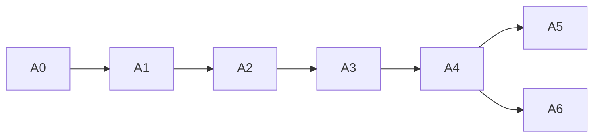

# Lin Hot Cooling — Thermal Agent Milestone Plan

| | |
| --- | --- |
| Version | 0.1 (started 2026-09-17) |
| Status | **Documentation only.** No build, code or packaging work has started. |
| Specification | [thermal-agent-spec.md](thermal-agent-spec.md) v1.2 |
| Parent plan | [milestones.md](milestones.md): agent work slots into M1.9, M3.5–M3.7 and M4 |
| Design | [ui-layout-spec.md](ui-layout-spec.md) v1.1 (heat-level colors), [mockups](mockups/README.md) |

## Owner decisions (2026-09-17)

| # | Decision | Consequence |
| --- | --- | --- |
| D1 | **Suggest is the default agent mode** | First run and reset both start in Suggest. Auto is opt-in only, offered once the machine has at least 1 h of history (A6). Observe stays available. |
| D2 | **Heat state is the default view.** Expanding shows the current template and mode, which can be changed for better results. | Every agent surface (panel indicator window, Overview card, compact bar) opens **collapsed**, showing heat only. An expander reveals the template, mode, recommendation and change controls. The expanded or collapsed choice is remembered per surface. |
| D3 | **Heat detection uses three colors:** green = nominal, yellow = medium, red = intense | Nominal → green; Elevated and Recovering → yellow; Hot and Critical → red (Critical adds a pulse and the emergency banner). The colors replace the earlier lime/amber/magenta heat colors everywhere (hero cards, gauges, meters, sparklines, indicator icon). |
| D4 | **A panel (tray) indicator** is part of the agent | The indicator shows the heat level; clicking it opens the collapsed mini window (A5). |

## Heat levels (reference for every milestone)

| Agent state | Heat level | Color token | Marks (on dark) | Text on dark | Hero / indicator fill | Text on fill |
| --- | --- | --- | --- | --- | --- | --- |
| Nominal | **Nominal** | `heat.nominal` | `#22C55E` | `#4ADE80` | `#DCFCE7 → #86EFAC → #22C55E` | `#052E16` (≥ 6.5:1) |
| Elevated, Recovering | **Medium** | `heat.medium` | `#FACC15` | `#FDE047` | `#FEF9C3 → #FDE047 → #EAB308` | `#1A1204` (≥ 9.7:1) |
| Hot | **Intense** | `heat.intense` | `#EF4444` | `#F87171` | `#DC2626 → #B91C1C → #7F1D1D` | `#FFFFFF` (≥ 4.8:1) |
| Critical | **Intense + emergency** | `heat.intense` | `#EF4444`, pulsing | `#F87171` | same, plus banner `#B91C1C` | `#FFFFFF` |

**Color is never the only signal.** Every level also shows a word (Nominal / Medium / Intense / Critical), and the indicator icon changes shape for each level: plain fan, fan + dot, fan + "!".

---

## How this plan runs

- **Rules:** the parent plan's definition of done, branching and tagging apply.
- **Work package IDs:** `A<n>.<m>`. Each maps onto a parent work package (column "Parent").
- **Order:** A0 must finish before any agent code is written (A1 onwards), so that design and spec are signed off first.
- **Safety:** the emergency path is built and tested together with the first action path (A3). The agent never ships with switching and without emergency handling.

### Overview

| Milestone | Theme | Parent | Depends on | Size |
| --- | --- | --- | --- | --- |
| **A0** Design sign-off | Mockups and specs updated to D1–D4 | before M1 | — | S |
| **A1** Monitoring core | Filters, prediction, heat score, state machine, heat levels | M1.9 | M1.1–M1.5, A0 | M |
| **A2** Heat views (read-only) | Collapsed heat view + expander on the card and compact bar; read-only template/mode | M1.9, M1.7 | A1 | M |
| **A3** Suggest mode | Recommendation engine, Apply from the expanded view, emergency path, manual override | M3.5, M3.7 | A2, M2 | L |
| **A4** Background agent | User service, `Agent1` D-Bus API, CLI, notifications | M3.6 | A3 | M |
| **A5** Panel indicator | Status icon by heat level, collapsed/expanded mini window | M3.7 | A4 | M |
| **A6** Auto mode + learning | Opt-in Auto, cooling history, history-based scoring | M4 | A4, M4.1 | M |

---

## A0 — Design sign-off (documentation and mockups only)

**Goal:** the specs and mockups reflect D1–D4 and are approved before implementation.

| ID | Work package | Details | Deliverables |
| --- | --- | --- | --- |
| A0.1 | Spec update | thermal-agent-spec v1.2: Suggest default, collapsed/expanded model, heat-level mapping, panel indicator, resolved open questions | `docs/thermal-agent-spec.md` (**done 2026-09-17**) |
| A0.2 | Token update | ui-layout-spec v1.1: `heat.*` tokens, hero gradients, gauge gradient, sparkline over-warning color, contrast table | `docs/ui-layout-spec.md` (**done 2026-09-17**) |
| A0.3 | Mockup update: colors | Recolor the Overview hero, gauges, meters and sparklines, and the agent card and state sheet, to green/yellow/red | `docs/mockups/*.dc.html`, design canvas |
| A0.4 | Mockup: collapsed/expanded card | Overview card in both views; compact bar in both views | New artboards |
| A0.5 | Mockup: panel indicator | The three indicator icons (with shape cues), mini window collapsed (320 × 132) and expanded (320 × 440), right-click menu | New artboards |
| A0.6 | Review and sign-off | Owner approves A0.3–A0.5; any change goes back into the specs | Entry in the decision log |

**Acceptance:** the owner approves the mockups; every heat color in them matches the heat-level table; the specs and mockups agree.

---

## A1 — Monitoring core (parent M1.9)

**Goal:** accurate, cheap, well-tested heat assessment. Nothing is switched yet.

| ID | Work package | Details (spec section) |
| --- | --- | --- |
| A1.1 | Snapshot model | A typed per-tick snapshot of zones, fans, power, throttle and workload signals from the state store (§3) |
| A1.2 | Adaptive sampler | Interval table 10 s / 5 s / 1 s / 500 ms driven by state, window visibility and power source (§3.1) |
| A1.3 | Filters | EWMA (time-constant based), 60 s regression slope, spike detection. Pure functions. (§3.2) |
| A1.4 | Limits resolver | Warning/critical limits per zone from trip points → machine profile → defaults (§3.2) |
| A1.5 | Time-to-limit predictor | Plugin (`Predictor`); capped at 60 min; ∞ for flat or falling temperatures (§3.2) |
| A1.6 | Heat-vector classifiers | One plugin per vector, rule-based confidences, dominant vectors ≥ 0.6 (§3.3) |
| A1.7 | Heat score | 0–100 plus the time-to-limit, throttle and fan-effort bonuses (§3.4) |
| A1.8 | State machine + heat level | Five states with hysteresis and dwell; mapped to Nominal / Medium / Intense (D3) (§4) |
| A1.9 | Replay fixtures | Recorded FX506LI sessions (idle, gaming, compile, render) + a second machine class; replay harness |

**Acceptance:**
- **Replays:** each recorded session produces the expected state sequence and heat levels.
- **Stability:** no state change under ±2 °C noise (property test).
- **Accuracy:** on the FX506LI, time-to-limit is within ±30 % for sustained loads.
- **Cost:** the core uses < 0.3 % CPU at 5 s sampling and < 0.8 % at 1 s.
- **Modularity:** the import-linter contract passes (the agent core has no GTK imports).

---

## A2 — Heat views, read-only (parent M1.9 / M1.7)

**Goal:** the heat state is the default view everywhere. Expanding shows the current template and mode (not changeable yet).

| ID | Work package | Details |
| --- | --- | --- |
| A2.1 | Heat-level styling | CSS classes `.heat-nominal/.heat-medium/.heat-intense` + `HeatLevel` view-model property; the Overview hero, gauges, meters and sparklines switch to `heat.*` tokens |
| A2.2 | Collapsed card | Overview card collapsed (default): state word in the heat color, heat meter, hottest zone + trend, forecast, 10-minute sparkline of the hottest zone, expander row "Template & mode" |
| A2.3 | Expanded card (read-only) | Current template (name, category, since when), mode (Suggest by default), top recommendations listed without Apply |
| A2.4 | Compact bar | Fans/Thermals variant, collapsed = heat only; the expander shows template + mode inline |
| A2.5 | Expansion state | Per-surface memory in `~/.config/lin-hot-cooling/ui.toml`; keyboard (Space/Enter on the expander, `aria-expanded`); 200 ms height animation (instant with reduced motion) |
| A2.6 | Accessibility | Level announced as a word; live region announces level changes at most once per 30 s; shape and label cues besides color |

**Acceptance:**
- **Defaults:** every surface starts collapsed and shows only heat information.
- **Colors:** they match the heat-level table in each replayed state.
- **Screen reader:** Orca reads "Heat level Medium, CPU 78 degrees, rising".
- **Memory:** the expansion state survives a restart.
- **Stability:** no layout jump larger than the expander height.

---

## A3 — Suggest mode, the default (parent M3.5 / M3.7; requires M2 helper)

**Goal:** the agent recommends better templates and you apply them from the expanded view, with emergency protection in place.

| ID | Work package | Details |
| --- | --- | --- |
| A3.1 | Candidate filter | Context filter (power source, lid, schedule), capability filter, empty-plan exclusion (§5.1) |
| A3.2 | Scoring engine | Relief, fit, acoustics, performance, history (0 until A6), penalties; weights from `data/agent/weights.yaml` (§5.2) |
| A3.3 | Reasons | Plain-language reason from the top two terms + expected relief in °C |
| A3.4 | Suggest-mode policy | Recommend when ≥ 15 points better in the Medium/Intense levels; "Not now" snoozes for 15 min; **default mode = Suggest (D1)** on first run and after a settings reset |
| A3.5 | Apply from the expanded view | Apply buttons in the expanded card and compact bar; pending spinner; lock glyph + polkit for fan/power templates; battery confirmation for intense templates |
| A3.6 | Manual override | Your choice wins for 10 minutes: no recommendations for that choice's slot unless the level becomes Critical |
| A3.7 | Emergency path | Critical → full fan (if available) + the profile named by the machine profile + red banner + lock; mirrored in the helper watchdog |
| A3.8 | Why feed integration | Every recommendation, apply, snooze and emergency is logged with its evidence |
| A3.9 | Recommendation surfaces | The collapsed view shows a small yellow or red "Suggestion available" dot next to the expander (without expanding); the expanded view shows the recommendation bar |

**Acceptance:**
- **Recommendation speed:** replaying the gaming fixture on General Operations raises a High-Intensity Gaming recommendation within 30 s of entering Intense.
- **Apply:** the change takes effect in under 2 s (the helper confirms the profile).
- **Snooze:** it holds for 15 min.
- **Emergency:** a simulated Critical locks switching, shows the red banner, and releases once the zones have been below warning for 60 s.
- **Default:** a fresh profile starts in Suggest.

---

## A4 — Background agent, D-Bus and notifications (parent M3.6)

| ID | Work package | Details |
| --- | --- | --- |
| A4.1 | `--agent` entry and user service | `lin-hot-cooling-agent.service` (user), `Restart=on-failure`, enabled from Settings; no GTK import |
| A4.2 | Single decision-maker | Session bus name `io.mensuramedia.LinHotCooling.Agent`; the GUI attaches to the agent, or runs the core in-process when no agent is running |
| A4.3 | `Agent1` API | `GetStatus`, `GetRecommendations`, `ApplyTemplate`, `SetMode`, `Snooze`, `PinTemplate`, plus signals (§6.1); `GetStatus` includes `heat_level` |
| A4.4 | CLI | `lin-hot-cooling agent status/templates/apply/mode` |
| A4.5 | Notifications | Suggest-mode recommendation (Apply / Not now), emergency, fallback; rate limits; Do Not Disturb respected (§6.2) |
| A4.6 | Config | `agent.toml` with `mode = "suggest"` as the default; schema validation (§6.3) |

**Acceptance:**
- **API contract:** the tests pass.
- **Single decision-maker:** a GUI started while the agent runs shows no second decision loop in the logs.
- **Notification actions:** they apply or snooze correctly.
- **Resources:** the agent stays under 0.5 % CPU and 40 MB RSS when idle.

---

## A5 — Panel indicator and mini window (parent M3.7)

**Goal:** the heat state is always visible in the panel. One click opens the collapsed mini window, which expands to show and change the template and mode.

| ID | Work package | Details |
| --- | --- | --- |
| A5.1 | Status icon backend | **XApp.StatusIcon** (libxapp, native on Cinnamon/Mint; left click activates, with the icon's position); fallback **AyatanaAppIndicator3** (menu-only) on other desktops; icon provider as a plugin |
| A5.2 | Icons | Three full-color SVG icons (green fan; yellow fan + dot; red fan + "!") plus a critical variant that alternates every 1 s (static with reduced motion); tooltip "Hot Cooling — Medium · CPU 78 °C" |
| A5.3 | Mini window, collapsed (default) | Undecorated, 320 × 132, placed next to the icon: state word in the heat color, heat meter, hottest zone + trend, forecast, expander "Template & mode", suggestion dot |
| A5.4 | Mini window, expanded | 320 × 440: current template (with category), mode segmented control (Observe / **Suggest** / Auto), recommendation bar with Apply, top 3 templates with Apply, "More templates…", "Open Hot Cooling" |
| A5.5 | Behavior | Closes on focus loss or Esc; remembers its expansion state; keyboard reachable; opens the main window on double-click |
| A5.6 | Right-click menu | Mode (radio), Snooze suggestions 1 h, Open Hot Cooling, Quit agent |

**Acceptance:**
- **Panel icon:** on Linux Mint 22 Cinnamon, it changes color and shape within 2 s of a level change.
- **Left click:** opens the collapsed mini window; the expander shows template and mode; applying a template from it works.
- **Other desktops:** on a desktop without XApp, the Ayatana menu offers the same actions.

---

## A6 — Auto mode opt-in and learning (parent M4)

| ID | Work package | Details |
| --- | --- | --- |
| A6.1 | Cooling history | Per template and vector mix: median °C drop after 2 min, stored in the history database |
| A6.2 | History score term | Enables the `history` weight (§5.2) once there are at least 3 samples |
| A6.3 | Auto opt-in | After at least 1 h of history in Suggest mode, a one-time card offers "Let Hot Cooling switch automatically?" You can decline, and Suggest stays the default. |
| A6.4 | Auto mode policy | ≥ 20-point gain, ≥ 20 s in Medium/Intense, 60 s dwell, 6 switches per hour, then fallback to Suggest with a notification (§5.3–§5.4) |
| A6.5 | Profiles full variant | Ranking with scores, selected plan, cooling-history chart (mockup `AgentProfiles`) |

**Acceptance:**
- **Opt-in:** Auto is never enabled without explicit consent.
- **Rate limits:** a replayed long session in Auto stays within them.
- **History:** after 5 gaming runs, the history term changes the ranking in the expected direction.

---

## Testing across milestones

| Level | Scope |
| --- | --- |
| Unit / property | Filters, predictor, score, state machine, heat-level mapping, scoring, rate limits, override window |
| Replay | Recorded FX506LI and second-machine sessions (expected states, levels, recommendations, emergency) |
| Integration | Agent + helper (dry run) on private buses; `Agent1` contract; notifications; GUI attach; status icon under Xvfb with a stub StatusNotifier watcher |
| UI | Collapsed/expanded views in every heat level; contrast snapshot checks; reduced motion; keyboard; Orca labels |
| Hardware in the loop | Suggest-mode recommendation timing; emergency behavior; indicator responsiveness |

## Tracking

| Milestone | Status | Notes |
| --- | --- | --- |
| A0 | **In progress** | A0.1 and A0.2 done 2026-09-17; mockup updates A0.3–A0.5 pending the owner's go-ahead |
| A1 | Not started | Needs M1.1–M1.5 |
| A2 | Not started | |
| A3 | Not started | Needs the M2 helper |
| A4 | Not started | |
| A5 | Not started | |
| A6 | Not started | Needs M4.1 |
