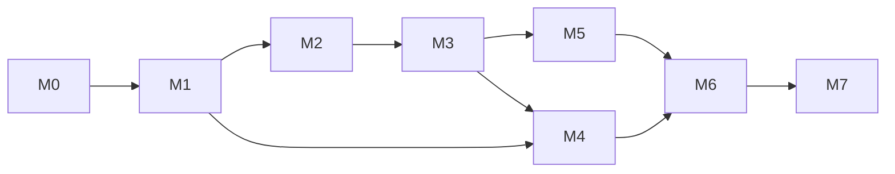

# Lin Hot Cooling — Milestone Plan

| | |
| --- | --- |
| Version | 0.1 (started 2026-09-17) |
| Source | [TECHNICAL-CONCEPT.md](../TECHNICAL-CONCEPT.md) v0.2 (section numbers below refer to it); [ui-layout-spec.md](ui-layout-spec.md); [thermal-agent-spec.md](thermal-agent-spec.md) |
| Repository | https://github.com/MensuraMedia/lin-hot-cooling (local checkout `~/projects/hot-cooling`) |
| Decisions in force | Thermal Agent: Suggest by default, heat-first collapsed views, green/yellow/red heat levels, panel indicator (2026-09-17); robust modularity and universality (§20: layered, registry/plugin-based, capability-driven, data-driven); GTK 3, written to be portable to GTK 4 (§19); custom non-commercial license; starter template `gtk-python-dashboard-starter`; MensuraMedia universal-instruction-set v2026.04; palette from `ui-ki-green-gray-black.jpg` |
| Reference hardware | ASUS TUF F15 FX506LI (laptop, one fan, auto/full only, no curves, NVIDIA on-demand without RTD3). A second machine class (a desktop with `nct6775`/`it87` PWM, or a ThinkPad) is needed from M1. |

---

## How milestones are run

- **Per milestone:**
  - Plan with `/plan-first`, execute work packages in order, run `/build-test` before every commit, and end sessions with `/session-end`.
  - Every change goes into `changelog.md`; decisions go into `.claude/memory/decisions.md`.
- **Branching:**
  - Work happens on `m<N>/<short-name>` branches and merges into `main` when the milestone's acceptance criteria pass.
  - Tags: `v0.<N>.0` at the end of each milestone (M6 → `v1.0.0`).
- **Definition of done (every work package):**
  1. Code is formatted and lint-clean (`ruff`); type-checked where required (`mypy --strict` for `core/`, `policy/`, `helper/`).
  2. Tests exist and pass (`pytest`); UI changes pass the `xvfb-run` smoke test.
  3. The GTK 4 portability lint and the import-linter layer contracts pass (from M0.6 / M0.10 onwards). New hardware or feature support is added as a registered module or data file, never as a special case in core, policy or UI.
  4. There are no GTK warnings on the console and no new tracebacks in the journal.
  5. Docs and the changelog are updated.
- **Safety rule:** nothing writes to hardware before M2, and every write path goes through the privileged helper.
- **Sizes:** S ≈ one focused session, M ≈ 2–3 sessions, L ≈ 4+ sessions.

### Overview

| Milestone | Theme | Depends on | Size | Tag |
| --- | --- | --- | --- | --- |
| **M0** Foundations | Project setup, starter import, design system, app skeleton | — | M | v0.0.1 |
| **M1** Read-only monitor | Collectors, state model, live pages, animated components | M0 | L | v0.1.0 |
| **M2** Helper + categories | Privileged helper, Idle/Optimal/Intense, Fans and Profiles pages | M1 | L | v0.2.0 |
| **M3** Templates + rules | Heat vectors, template catalog, resolver, automation | M2 | L | v0.3.0 |
| **M4** Insight | History, benchmarks, power page | M1 (M3 for comparisons) | M | v0.4.0 |
| **M5** Advanced control | Software fan curves, RAPL caps, charge pause, integrations | M3 | L | v0.5.0 |
| **M6** Release | Debian packaging, AppStream, docs, i18n scaffold | M1–M5 | M | v1.0.0 |
| **M7** GTK 4 port | Version flip, compat shims removed, optional libadwaita | M6 | M | v2.0.0 |

---

## M0 — Foundations (in detail; next up)

**Goal:** a themed, runnable, well-structured application skeleton on the starter template, with the universal standards, tooling and GTK 4 portability rules in place. **No hardware access.**

### Work packages

| ID | Work package | Details | Deliverables |
| --- | --- | --- | --- |
| **M0.1** | Project initialization (universal set) | `universal-agents/setup.sh ~/projects/hot-cooling "Lin Hot Cooling" "GTK thermal management utility for Debian-based Linux"`; `universal-permissions/setup.sh`; fill in `CLAUDE.md` (v2026.04 template); memory structure; `changelog.md`; `.claudeignore`; keep the universal rules untouched; add `python-gtk.md`, `privileged-helper.md` and `thermal-safety.md` rules; enable the ruff section in `post-edit-lint.sh`; seed `decisions.md` from TECHNICAL-CONCEPT §18 decisions | `.claude/**`, `CLAUDE.md`, `changelog.md`, `.claudeignore` |
| **M0.2** | Import the starter template | Copy `gtk-python-dashboard-starter` (at commit `919eea7`) into `src/` and `resources/`, keeping its module headers and attribution; record the source commit in NOTICE; remove demo pages `page_button03–06` | `src/**`, `resources/**`, `run.sh`, `requirements.txt` |
| **M0.3** | Application skeleton | Convert `main.py` to `Gtk.Application` (`io.mensuramedia.LinHotCooling`, single instance, `--agent` / `--debug` / `--version` options); `src/gtk_version.py` version gate (`HC_GTK`, default 3.0); stub pages Overview, Fans, Thermals, Power, Profiles, Templates, Automation, Hardware, Benchmarks, History, Settings, About (all `BasePage`) | `src/main.py`, `src/app.py`, `src/gtk_version.py`, `src/pages/page_*.py` |
| **M0.4** | Design system | Tokens in `config/config_theme.py` (TECHNICAL-CONCEPT §10.1), `resources/css/lin-hot-cooling.css` (§10.3), "Hot Cooling Lime" as the default theme in `config_themes.py` (starter themes kept as optional accents); Inter font check with fallbacks; sidebar widened to 200 px with icon + label buttons; hairline cards, pill buttons, segmented control styles | `src/config/*`, `resources/css/*` |
| **M0.5** | Iconography v1 + app icon | 24 px symbolic SVG set (§9.4: fan, thermometer, flame, snowflake-gauge, bolt, plug, battery, chip, gpu, drive, leaf, scale, rocket, gamepad, hourglass, briefcase, moon, wand, shield, info); app icon (SVG + 16–512 PNG); GResource bundle and loader | `resources/icons/**`, `resources/lin-hot-cooling.gresource.xml`, `src/utils/resources.py` |
| **M0.6** | GTK 4 compat layer + portability lint | `src/ui/compat.py` (`append`, `set_child`, `show`, `CanvasArea` with `on_draw(cr, w, h)`, gesture helpers); `tools/gtk4_lint.py` bans `pack_start`, `show_all`, `button-press-event`, `override_*`, `Gtk.Menu`, `Gdk.Screen`, `set_position` in `src/pages`, `src/ui` and `src/viewmodels` | `src/ui/compat.py`, `tools/gtk4_lint.py` |
| **M0.7** | Motion foundation | `src/core/easing.py` (cubic-bezier, critically damped spring), `src/ui/components/animated.py` (tick-callback base that pauses when unmapped and honours `gtk-enable-animations` + the app's reduced-motion setting); a demo `FanRotor` driven by a fake RPM slider on the About page | `src/core/easing.py`, `src/ui/components/animated.py`, `fan_rotor.py` (demo) |
| **M0.8** | Tooling and CI | `pyproject.toml` (ruff, mypy, pytest config); `tests/ui/test_smoke.py` (every page builds under `xvfb-run`, no GTK criticals); GitHub Actions workflow on `ubuntu-24.04` (apt: `python3-gi gir1.2-gtk-3.0 python3-gi-cairo xvfb`); `make check` target | `pyproject.toml`, `tests/**`, `.github/workflows/ci.yml`, `Makefile` |
| **M0.9** | Developer run path | `run.sh` creates a venv **with `--system-site-packages`**, installs dev dependencies, compiles the GResource and launches; `docs/development.md` | `run.sh`, `docs/development.md` |
| **M0.10** | Modular core scaffolding (§20) — **do right after M0.2**; M0.3–M0.7 build on it | `core/interfaces.py` (Collector, Actuator, Page, Trigger protocols), `core/registry.py` (built-in + entry-point discovery), `core/context.py` (`AppContext` dependency injection), `core/events.py` (typed event bus), `core/paths.py`, `core/ids.py`, `core/units.py`; the sidebar is generated from the page registry; import-linter layer contracts in CI | `src/core/*`, `pyproject.toml` contracts |

### Acceptance criteria (M0)
1. `./run.sh` opens a 1200×800 window with the lime/navy theme, a 200 px icon sidebar and 12 navigable stub pages. There are no console warnings.
2. A second launch focuses the existing window (single instance).
3. The demo rotor animates smoothly at 60 Hz, stops when minimized, and shows a static ring when reduced motion is on. The window's CPU use while animating is under 2 % on the FX506LI (measured with `pidstat`).
4. `make check` passes: ruff, mypy (configured), pytest, the UI smoke test and the GTK 4 lint. The same checks pass in GitHub Actions.
5. The universal-standards compliance checklist is complete (README of universal-instruction-set).
6. NOTICE lists the starter template commit, and the licence headers are present.
7. Pages are discovered through the registry, so adding a page needs no edits to the sidebar or content area. The import-linter layer contracts pass, and there are no vendor names outside providers or data (checked by a grep test).

### Risks (M0)
- **Inter font may be missing on target systems.** Fall back to Ubuntu/Cantarell; bundling the font needs a license check (OFL is fine).
- **The starter's CSS relies on GTK 3-only selectors.** Normalize them while porting to the design tokens.

---

## M1 — Read-only monitor

**Goal:** accurate, efficient, beautiful live monitoring on at least two machine classes. **Still no writes.**

| ID | Work package | Key points (TECHNICAL-CONCEPT §) |
| --- | --- | --- |
| M1.1 | Core state and scheduler | `core/state.py` GObject store and signals; per-collector cadence scheduler on a worker thread; `GLib.idle_add` hand-off (§5) |
| M1.2 | Collectors: platform | `dmi`, `hwmon` (temperatures and fans with stable IDs), `thermal_zone` (trip points), `cpufreq` + `intel_pstate` + throttle counters, `power_supply` (AC, drain W, charge limit) (§4.1) |
| M1.3 | Collectors: graphics | `drm_fdinfo` (i915/xe busy %), `nvidia` (NVML with `nvidia-smi` fallback: temp/W/util/VRAM/P-state/throttle reasons/RTD3), `amdgpu` (hwmon), PRIME state |
| M1.4 | Collectors: services and workload | power-profiles-daemon D-Bus, systemd unit states (thermald, TLP, asusd, fancontrol, coolercontrold), GameMode D-Bus, process classes (Steam reaper, Proton) |
| M1.5 | Capability manifest + machine profiles | Probe → manifest JSON; `data/machines/asus/fx506li.json` (§4.2); zone topology; degradation matrix states (§4.3) |
| M1.6 | Components | `FanRotor`, `ThermalGauge`, `HeatSparkline`, `HeroCard` (cool/warm/hot gradients), `PulseDot`, `HeatVectorChip` (§9.2) |
| M1.7 | Pages | Overview, Thermals and Hardware (capability matrix + conflicts), with read-only views of Fans and Power |
| M1.9 | Thermal Agent core (read-only); detailed in [milestones-thermal-agent.md](milestones-thermal-agent.md) A1–A2 | [thermal-agent-spec.md](thermal-agent-spec.md): filters (EWMA, slope, spikes), time-to-limit, heat score, assessment state machine; Cooling Template Card showing status and the template list (Apply disabled until M3) |
| M1.8 | Fixtures and tests | Recorded sysfs trees from the FX506LI + a second machine under `tests/fixtures/sysfs/`; collector unit tests against them; stable-ID tests across hwmon renumbering |

**Acceptance:**
- Readings on the FX506LI match `sensors`, `nvidia-smi` and `fx506li-handoff.sh` within ±1 °C / ±50 RPM / ±0.5 W.
- The second machine renders correctly.
- The capability matrix states "no fan curves" with the reason on the FX506LI.
- With the window visible, CPU use is under 2 %; when hidden, sampling drops to 5 s and CPU use is under 0.3 %.
- There are no uncaught exceptions during 8 h of running.

---

## M2 — Privileged helper + cooling categories

**Goal:** safe, authorized control. The three categories work end to end.

| ID | Work package | Key points |
| --- | --- | --- |
| M2.1 | Helper service skeleton | `helper/service.py` on the system bus `io.mensuramedia.LinHotCooling1`; D-Bus activation; systemd unit with sandboxing (§8) |
| M2.2 | polkit + D-Bus policy | Actions `apply-profile` (active local session: yes), `apply-fan` and `apply-power-limits` (auth_admin_keep), `configure-rules` |
| M2.3 | Validation | The helper probes its own manifest; allow-listed attribute map; range checks; plan schema; client-supplied paths are rejected |
| M2.4 | Actuators v1 | power-profiles-daemon profile (preferred) / `platform_profile`; EPP; turbo; fan mode auto↔full (asus-wmi `pwm1_enable` 2/0) with a lease; RAPL read (watts, averaged ≥ 1 s) |
| M2.5 | Leases, watchdog, emergency path | Lease renewal; revert on client loss, helper stop (`ExecStopPost`) and critical temperature (§13) |
| M2.6 | Helper client + dry-run mode | Typed proxy; `--session-bus --dry-run` for UI work without root |
| M2.7 | Categories | Idle / Optimal / Intense baseline mappings (§7.1) resolved against capabilities |
| M2.8 | Pages | Profiles (category cards + CategorySwitch), Fans (Max-fan boost with countdown), "Why" feed v1 |
| M2.9 | Security review + fuzzing | Hypothesis fuzzing of `ApplyPlan`; code-reviewer agent pass; `docs/security.md` |

**Acceptance:**
- Switching categories changes the profile and EPP on the FX506LI, and `powerprofilesctl get` agrees.
- Max-fan boost reaches maximum RPM and returns to auto when its lease expires.
- Killing the GUI or the helper reverts to auto within 5 s.
- A simulated critical temperature triggers the emergency path.
- The fuzzer finds no accepted invalid plan.
- Polkit prompts behave per action.

---

## M3 — Heat vectors, templates and rules

**Goal:** workload-aware automatic cooling with explanations.

| ID | Work package | Key points |
| --- | --- | --- |
| M3.1 | Schemas | JSON Schemas for heat vectors, templates, plans and machine profiles (`data/schema/`) |
| M3.2 | Heat vectors | 8 vectors (§6), each with detection, envelope and actuator bias |
| M3.3 | Template catalog | 9 shipped templates (§7.2), read-only, with user clones in `~/.config/lin-hot-cooling/templates/` |
| M3.4 | Resolver | Category → template → user overrides → capability filter → conflict filter → diff → plan, with "not applied: reason" notes (§7.3) |
| M3.5 | Rule engine + agent recommendations | Triggers (AC/battery, GameMode, process class, temperature thresholds, utilization windows, lid, schedule), priorities, hysteresis, dwell (§7.4) |
| M3.6 | Thermal Agent service (A3–A5; **Suggest mode by default**, panel indicator) | `lin-hot-cooling --agent` as a systemd **user** unit; `io.mensuramedia.LinHotCooling.Agent1` D-Bus API + CLI; recommendation engine with Observe/Suggest/Auto modes, rate limits and notifications (thermal-agent-spec §5–§6) |
| M3.7 | Pages + Cooling Template Card actions | Templates (catalog grid, detail with resolved targets, clone/edit with form + YAML), Automation (rules, test trigger, event history), a full "Why" feed |
| M3.8 | Reference policy | Default rules: AC → performance, battery → quiet, game → High-Intensity Gaming (AC), load end → Cool-down. This matches `optimize-laptop-asus-fx50li/docs/fan-control.md`. |

**Acceptance:**
- Unplugging AC switches to quiet within 2 s, and plugging it back in restores performance.
- Suspending on AC, unplugging while asleep and resuming lands in quiet.
- Starting a Steam game activates the gaming template; ending it runs Cool-down, then returns to the power-source default.
- There's no switching back and forth under a synthetic temperature oscillation of ±2 °C.
- Every action appears in the "Why" feed and the journal with its trigger and template.

---

## M4 — Insight: history, benchmarks, power

| ID | Work package | Key points |
| --- | --- | --- |
| M4.1 | History store | SQLite with 1 s samples for 10 min, 1 min for 30 days; action log; retention and vacuum |
| M4.2 | History page | 1 h / 24 h / 7 d charts, action-log filters, CSV export |
| M4.3 | Benchmarks | Port of `bench-gpu-thermal.sh`: guided idle → load (glmark2 / stress-ng) → cool-down per category or template; comparison report (FPS, temperatures, RPM, throttle deltas, W, iGPU %, IOPS) |
| M4.4 | Power page | Source, drain, charge limit, CPU package W (helper), GPU W, EPP/turbo, PRIME advice (`gpu.idle-leak`) |
| M4.5 | Diagnostics export | Redacted bundle: manifest, recent history, journal excerpt |

**Acceptance:**
- A benchmark run on the FX506LI reproduces the manual script's metrics within 5 %.
- The history database stays under 50 MB after 30 days.
- The export contains no serial numbers or MAC addresses.

---

## M5 — Advanced control

| ID | Work package | Key points |
| --- | --- | --- |
| M5.1 | Software fan curves | For manual-PWM machines: a 1 Hz helper loop with hysteresis, minimum duty and a watchdog; curve editor UI (hidden where unsupported) |
| M5.2 | Firmware curves | Writes `pwm*_auto_point*` where the driver supports them (asus-wmi models with curves, amdgpu) |
| M5.3 | Power limits | RAPL PL1/PL2 caps within firmware maxima, per template; NVML power limits on GPUs that allow them |
| M5.4 | Charge pause | `power.charging` vector: pause or limit charging during intense runs when the battery is hot |
| M5.5 | Integrations | TLP, asusd and CoreCtrl detection plus integration modes; never fight another manager (§2) |
| M5.6 | Hardware matrix | Tests on at least 3 machine classes; contribute their machine profiles |

**Acceptance:**
- The curve on a PWM desktop tracks its setpoints within ±5 % duty.
- PL1 caps hold within 1 W.
- The conflict detector pauses automation when TLP changes a managed control.
- All emergency and watchdog tests still pass.

---

## M6 — Release (v1.0.0)

| ID | Work package | Key points |
| --- | --- | --- |
| M6.1 | Debian packaging | `debhelper-compat 13`, `dh-python`; files per §12; `debian/copyright` with the custom license and NOTICE; `lintian` clean |
| M6.2 | Desktop integration | `.desktop`, AppStream metainfo with screenshots, icons in `hicolor` |
| M6.3 | Distribution | GitHub release `.deb`; optional PPA or own apt repository (the license rules out the official archives) |
| M6.4 | Documentation | User guide, template-authoring guide, machine-profile guide, security model, FAQ |
| M6.5 | i18n scaffold | gettext setup; English source strings |
| M6.6 | Release QA | Install, upgrade and remove on Debian 12, Ubuntu 24.04 and Mint 22 (X11 + Wayland); uninstall restores firmware auto |

**Acceptance:**
- A clean install on all three distributions works.
- Removal leaves no system changes behind.
- `desktop-file-validate` and `appstreamcli validate` pass.

---

## M7 — GTK 4 port (v2.0.0)

| ID | Work package | Key points |
| --- | --- | --- |
| M7.1 | Version flip | `HC_GTK=4.0`; fix any API gaps surfaced by the tests |
| M7.2 | Shim removal | Replace `ui/compat.py` calls with native GTK 4 calls; `CanvasArea` → `set_draw_func` |
| M7.3 | Styling | CSS review for GTK 4; optional libadwaita (`Adw.Application`, `Adw.NavigationSplitView`) while keeping the Lime design |
| M7.4 | Packaging | Dependencies `gir1.2-gtk-4.0` (+ `gir1.2-adw-1`); keep a GTK 3 build for older targets if needed |

**Acceptance:**
- Same feature set as v1.
- All tests pass on GTK 4.
- The visual regression suite is within tolerance.

---

## Tracking

| Milestone | Status | Started | Finished | Notes |
| --- | --- | --- | --- | --- |
| M0 | Not started | — | — | Next up |
| M1 | Not started | — | — | Needs a second test machine |
| M2 | Not started | — | — | |
| M3 | Not started | — | — | |
| M4 | Not started | — | — | |
| M5 | Not started | — | — | |
| M6 | Not started | — | — | |
| M7 | Not started | — | — | |
