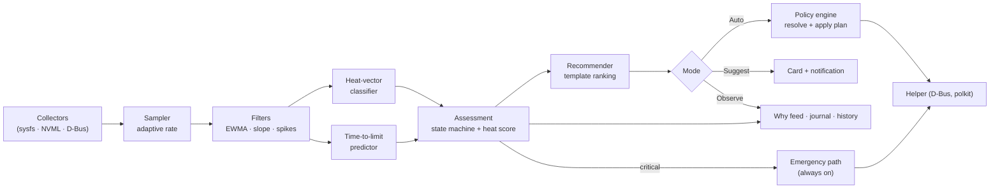
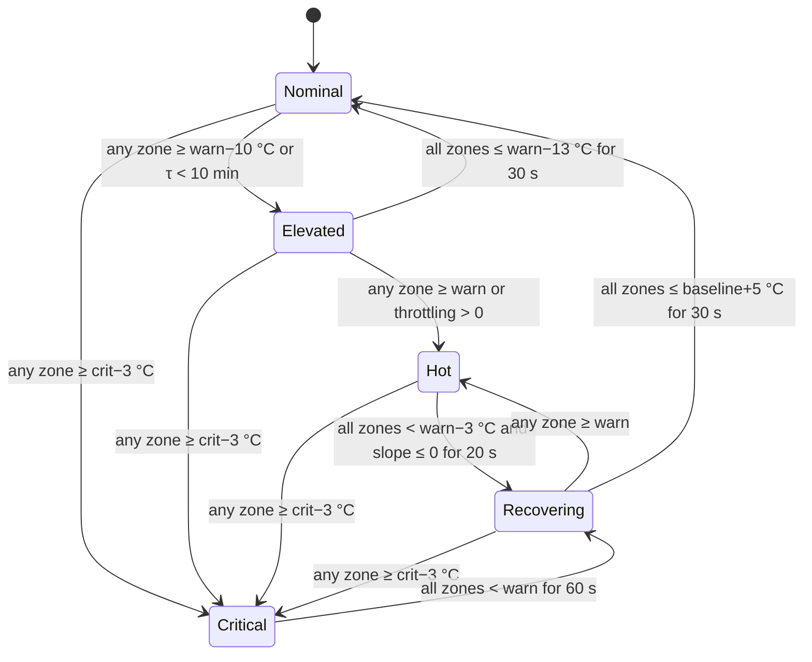

# Lin Hot Cooling — Thermal Agent and Cooling Template Card

| | |
| --- | --- |
| Version | 1.2 (2026-09-17): owner decisions D1–D4 (Suggest default, heat-first collapsed views, green/yellow/red heat levels, panel indicator) |
| Mockups | `docs/mockups/AgentOverview.dc.html`, `AgentProfiles.dc.html`, `AgentStates.dc.html`; reusable component `AgentCard.dc.html` |
| Status | Specification (not implemented) |
| Related | [TECHNICAL-CONCEPT.md](../TECHNICAL-CONCEPT.md) §3 (process model), §6 (heat vectors), §7 (categories, templates, rules), §8 (helper), §13 (safety), §20 (modularity); [ui-layout-spec.md](ui-layout-spec.md) (tokens and components); [milestones.md](milestones.md) M3.5–M3.7 |
| Milestones | Detailed plan: [milestones-thermal-agent.md](milestones-thermal-agent.md) (A0–A6), which slots into M1.9, M3.5–M3.7 and M4 |

The **Thermal Agent** is the component that continuously watches heat, understands what is causing it, and makes sure the right cooling template is active. It either asks first or acts automatically, depending on the mode you choose. The **Cooling Template Card** is its face in the UI: it shows what the agent sees and lets you switch templates to cool the system down properly.

### Owner decisions (2026-09-17)

| # | Decision |
| --- | --- |
| D1 | **Suggest is the default mode.** Auto is opt-in only (offered after at least 1 h of history). |
| D2 | **Heat state is the default view** on every agent surface. Expanding reveals the current template and mode, which can be changed there. |
| D3 | **Heat levels use three colors:** green = nominal, yellow = medium, red = intense (§3.5). |
| D4 | **A panel indicator** shows the heat level and opens the collapsed mini window (§7.6). |

---

## 1. Responsibilities

1. **Monitor:** sample every thermal zone, fan, power and throttle signal at an adaptive rate, with or without the main window open.
2. **Understand:**
   - smooth the signals;
   - detect trends;
   - classify the active **heat vectors** (TECHNICAL-CONCEPT §6);
   - predict **time to limit** for each zone.
3. **Assess:** keep a thermal **state** (§4) with hysteresis, and a **heat score** from 0 to 100.
4. **Decide:** rank the cooling templates that would best bring the system back into its envelope (§5), respecting your mode, rules and hardware capabilities.
5. **Act or advise:**
   - **Auto mode:** apply the chosen template through the policy engine and helper.
   - **Suggest mode:** raise a recommendation on the card and as a desktop notification with actions.
   - **Observe mode:** only report.
6. **Protect:** trigger the emergency path at critical temperatures. This is independent of the mode and can't be switched off.
7. **Explain:** log every assessment change and action with its trigger, evidence and outcome in the "Why" feed and the journal.
8. **Learn** (M4): record how each template actually cooled this machine, and use that to improve future rankings.

**What the agent never does:**
- write to hardware directly (all writes go through the helper, §8 of the concept);
- override firmware or thermald protection;
- fight another power manager (conflict rule, concept §2);
- switch templates more often than its rate limits allow (§5.4).

---

## 2. Process and placement

| Aspect | Design |
| --- | --- |
| Binary | `lin-hot-cooling --agent` (same package and code base; no GTK import in agent mode) |
| Lifecycle | systemd **user** unit `lin-hot-cooling-agent.service`; `WantedBy=graphical-session.target`; `Restart=on-failure`; enabled from Settings → Background agent |
| Single instance | Owns the session bus name `io.mensuramedia.LinHotCooling.Agent`. When the GUI starts, it connects to the running agent instead of running its own policy loop, so there is **one decision-maker per session**. |
| Without the agent | The GUI runs the same agent core in-process while the window is open, and stops it when the window closes. |
| Privileges | None. Actions go through the helper (`io.mensuramedia.LinHotCooling1`, polkit); the agent needs only `apply-profile`, which is allowed for the active local session without a prompt. |
| Resources | Target < 0.5 % CPU and < 40 MB RSS while idle; < 1 % CPU while under heat |
| Modularity | The agent core (`src/agent/`) depends only on `core`, `policy`, collectors and `helper_client` (import-linter contract). Classifiers, predictors and recommenders are registered plugins (§9). |



---

## 3. Monitoring pipeline

### 3.1 Sampling

| Situation | Interval | Signals |
| --- | --- | --- |
| Nominal, window hidden | 5 s | Zone temperatures, fan RPM, AC/battery state, GameMode, top process class |
| Nominal, window visible | 1 s | + utilization, frequencies, GPU power and P-state |
| Elevated or hot | 1 s | Everything, plus throttle counters and NVMe temperature |
| Critical | 500 ms | Everything (emergency path) |
| On battery and nominal | 10 s | Reduced set |

Sampling runs on a worker thread using the collectors' `sample()` methods (TECHNICAL-CONCEPT §4). Expensive sources (SMART, RAPL through the helper) keep their own slower cadence.

### 3.2 Signal processing (per zone *z*)

| Quantity | Definition |
| --- | --- |
| Smoothed temperature `T̂z` | EWMA with α = 0.3 at 1 s (time-constant based, so it is correct at any interval) |
| Slope `Ṫz` (°C/min) | Linear regression over the last 60 s of `T̂z` |
| Spike flag | Raw rise of more than 8 °C within 3 s (CPU bursts) |
| Headroom `Hz` | `Twarn,z − T̂z` (°C); `Twarn` and `Tcrit` come from thermal-zone trip points, the machine profile or defaults (CPU 85/97, dGPU 80/90, NVMe 70/80, battery 45/55, chipset 75/90) |
| Time to warning `τz` | `Hz / Ṫz` when `Ṫz > 0.2 °C/min`, else ∞; capped at 60 min |
| Throttle rate | Δ `package_throttle_count` per minute (CPU); NVML throttle reasons (GPU) |
| Fan effort | RPM ÷ max RPM (or duty); ≥ 0.9 while temperatures still rise means the cooling is saturated |

### 3.3 Heat-vector classification

Each rule-based classifier outputs a confidence from 0 to 1 per heat vector. The concept document's vector detection fields are the source; M4 may add learned weights.

| Vector | Evidence (examples) |
| --- | --- |
| `cpu.burst` | Spike flags, CPU utilization bursts < 20 s, Ṫcpu high but short-lived |
| `cpu.sustained` | CPU utilization > 70 % for > 2 min, Ṫcpu flat near the plateau, rising throttle rate |
| `gpu.sustained` | dGPU utilization > 60 % for > 1 min, P0, GPU power > 50 % of its limit |
| `gpu.idle-leak` | dGPU awake at P8 with < 5 % utilization for > 10 min, and RTD3 unsupported |
| `mixed.gaming` | GameMode client or Steam/Proton process + CPU and GPU both loaded |
| `io.storage` | NVMe temperature rising + IOPS above threshold |
| `power.charging` | AC online, battery charging, battery temperature rising |
| `ambient.chassis` | Idle baseline drifting up across zones with low load; lid closed on AC |

The **dominant vectors** are those with confidence ≥ 0.6. They drive the recommendation (§5).

### 3.4 Heat score

`S = max over zones of clamp(100 × (T̂z − Tidle,z) / (Tcrit,z − Tidle,z), 0, 100)`, raised by:
- +10 if τ(any zone) < 5 min;
- +10 if the throttle rate is above 0;
- +10 if fan effort ≥ 0.9 and temperatures are still rising.

The result is capped at 100. The score drives the card's meter and the ranking urgency.

### 3.5 Heat levels (D3)

The five assessment states (§4) map to three user-facing **heat levels**. These are the only colors used for heat detection anywhere in the app.

| Heat level | States | Marks on dark | Text on dark | Fill gradient (hero, indicator, mini window) | Text on fill |
| --- | --- | --- | --- | --- | --- |
| **Nominal** (green) | Nominal | `#22C55E` | `#4ADE80` | `#DCFCE7 → #86EFAC → #22C55E` | `#052E16` |
| **Medium** (yellow) | Elevated, Recovering | `#FACC15` | `#FDE047` | `#FEF9C3 → #FDE047 → #EAB308` | `#1A1204` |
| **Intense** (red) | Hot, Critical | `#EF4444` | `#F87171` | `#DC2626 → #B91C1C → #7F1D1D` | `#FFFFFF` |

- **Critical** keeps the red level and adds a 1 s pulse (static with reduced motion) plus the emergency banner (`#B91C1C`, white text).
- **Always labeled:** the level is always named in words, and the indicator icon changes shape per level, so color is never the only cue.
- **Meter and gauge gradient:** `#22C55E → #FACC15 → #EF4444`.

---

## 4. Assessment state machine



| State | Heat level (§3.5) | Agent behavior |
| --- | --- | --- |
| Nominal | Nominal (green) | Keeps the power-source default or the current workload template; considers stepping down to a quieter template |
| Elevated | Medium (yellow) | Re-ranks templates; in Suggest mode, recommends when a better template is at least 15 points ahead |
| Hot | Intense (red) | Recommends or applies the top cooling template; allows a fan boost |
| Recovering | Medium (yellow) | Holds the cooling template; schedules Cool-down → default |
| Critical | Intense (red) + pulse + emergency banner | **Emergency path:** full fan (if available) + the firmware's most protective profile (quiet when thermald and firmware limit power, otherwise performance for maximum fan table, as the machine profile specifies) + notification; locks switching |

Hysteresis values are configurable per machine profile. The defaults are shown above.

---

## 5. Recommendation engine

### 5.1 Candidates
- **Included:** all templates (shipped + user) whose `applies_when` doesn't contradict the current context (power source, lid, schedule), plus the category baselines.
- **Excluded:** templates whose resolved plan is empty on this machine (every target unsupported).

### 5.2 Scoring (0–100)

For each candidate *t*:

`score(t) = 0.40·relief(t) + 0.20·fit(t) + 0.15·acoustics(t) + 0.15·performance(t) + 0.10·history(t) − penalties(t)`

| Term | Meaning |
| --- | --- |
| `relief` | Expected cooling effect for the dominant vectors: from the template's actuator bias (concept §6), scaled by the actuators actually available (a fan boost is worth nothing where no fan control exists) |
| `fit` | Overlap between the template's `heat_vectors` and the dominant vectors (confidence-weighted) |
| `acoustics` | Preference for quieter results; weight rises at night, in Quiet Office, and on battery |
| `performance` | Keeps performance for the active workload (gaming or long runs get a high weight) |
| `history` | Observed cooling on this machine (M4): median °C drop after 2 min for this template and vector mix, normalized |
| `penalties` | −30 if it needs AC while on battery; −20 if it would override a manual choice made < 10 min ago; −50 if it conflicts with another manager; −100 if a required capability is missing |

The weights are data (`data/agent/weights.yaml`) and can be overridden per user. The top three candidates are shown on the card, each with a **reason** string built from the top two contributing terms, for example "Best relief for sustained CPU load · keeps game performance".

### 5.3 Decision by mode

| Mode | Behavior |
| --- | --- |
| **Observe** | Assess and rank; show the ranking; never change anything except the emergency path |
| **Suggest** (default, D1) | When the top candidate beats the active template by ≥ 15 points in Elevated/Hot, show a recommendation on the card and a notification with **Apply** / **Not now** actions. "Not now" snoozes that recommendation for 15 minutes. |
| **Auto** (opt-in only) | Offered once the machine has at least 1 h of history (never enabled silently). Applies the top candidate when it beats the active template by ≥ 20 points and the state has been Elevated/Hot for ≥ 20 s. Step back down (Cool-down → default) when Recovering → Nominal. |

A manual template choice (card, Templates page, Profiles page) always wins. The agent follows it and only recommends, with no auto-switching, for **10 minutes** or until the state becomes Critical.

### 5.4 Stability and rate limits
- **Dwell:** at least 60 s on a template before another automatic change, except for Critical.
- **Rate:** at most 6 automatic switches per hour. Above that, the agent falls back to Suggest mode and notifies.
- **Thresholds:** templates that differ only in acoustics are not switched between for less than 10 points of gain.
- **Leases:** fan boosts use helper leases (concept §8) and expire unless the agent renews them while the condition holds.

---

## 6. Interfaces

### 6.1 Session D-Bus API — `io.mensuramedia.LinHotCooling.Agent1`

| Member | Signature | Description |
| --- | --- | --- |
| `GetStatus()` | → `a{sv}` | state, heat_score, dominant_vectors, zones (T̂, slope, τ, headroom), fan_effort, active_template, mode, last_action |
| `GetRecommendations()` | → `aa{sv}` | Ranked candidates: id, name, category, score, reason, expected_relief_c, requires_auth, available |
| `ApplyTemplate(id: s, source: s)` | → `(b ok, s message)` | Applies through the policy engine; `source` is `card`, `notification`, `templates-page` or `cli`, and counts as a manual choice |
| `SetMode(mode: s)` | → `b` | `observe` / `suggest` / `auto` |
| `Snooze(recommendation_id: s, seconds: u)` | → `b` | Snoozes a recommendation |
| `PinTemplate(id: s, pinned: b)` | → `b` | Marks a template as a favorite on the card |
| Signal `StatusChanged(a{sv})` | — | On a state or active-template change, and at most every 1 s for values |
| Signal `RecommendationRaised(a{sv})` | — | When Suggest mode raises a recommendation |
| Signal `ActionTaken(a{sv})` | — | Every change the agent applied (for the "Why" feed) |
| Signal `EmergencyChanged(b active, s reason)` | — | Emergency path entered or left |

The API is versioned (`…Agent1`) and restricted to the same user by the session bus. The CLI gets matching commands:
- `lin-hot-cooling agent status`;
- `… agent templates`;
- `… agent apply <id>`;
- `… agent mode <mode>`.

### 6.2 Notifications
- Sent through `org.freedesktop.Notifications`, with actions.
- **Types:**
  - recommendation (normal urgency, actions Apply / Not now);
  - emergency (critical urgency, action Open);
  - agent fallback to Suggest (low urgency).
- **Limits:** at most one notification per 5 minutes, except emergencies. Respects Do Not Disturb, except for emergencies.

### 6.3 Configuration — `~/.config/lin-hot-cooling/agent.toml`

```toml
mode = "suggest"                 # observe | suggest | auto
autostart = true
notifications = true
quiet_hours = "22:00-07:00"      # raises the acoustics weight
manual_override_minutes = 10
max_auto_switches_per_hour = 6
pinned_templates = ["gaming-high-intensity", "long-running", "quiet-office"]

[thresholds]                     # optional overrides; machine profile values otherwise
cpu_warn_c = 85
gpu_warn_c = 80
```

The file is validated against `data/schema/agent-config.json`, and invalid values fall back to defaults with a logged warning.

---

## 7. The Cooling Template Card — `CoolingTemplateCard`

The card shows the agent's view and lets you switch templates in one step.

### 7.0 Presentation model: heat first, then expand (D2)

Every agent surface has two views.

| View | Default | Shows | Controls |
| --- | --- | --- | --- |
| **Collapsed** | **Yes** | Heat level (word in the level color), heat meter, hottest zone + trend, forecast; on the Overview card also a 10-minute sparkline of the hottest zone; a small level-colored "Suggestion available" dot when the agent has a recommendation | Expander "Template & mode ▾" |
| **Expanded** | On request | Everything above, plus the current template (name, category, since when), the mode (Observe / **Suggest** / Auto), the recommendation bar, and the template rows with Apply | Mode switch, Apply, Not now, More templates… |

- **Memory:** the expansion state is remembered per surface (`ui.toml`).
- **Expander:** a disclosure button (`aria-expanded`), toggled with Space/Enter; the 200 ms height animation is instant with reduced motion.
- **Emergency:** while Critical, collapsed views show the red banner without expanding.

### 7.1 Placement
- **Overview:** replaces the right-hand bottom card (Thermal zones) when the agent is enabled. The zone sparklines move to the Thermals page, and the card's status line always names the hottest zone. Card size at the default window: **492 × 300** (half of the bottom row).
- **Fans and Thermals:** a compact variant (single row, §7.4) above the capability strip.
- **Profiles:** the full-width variant (§7.5).

### 7.2 Anatomy (standard variant)

```
┌─ Thermal Agent ─────────────────────────────── ● Suggest ▾ ─┐
│ [heat meter ▓▓▓▓▓▓▓░░░ 68]  Hot · CPU 91 °C ↑1.8 °C/min      │
│  Warning in ~3 min · sustained CPU + GPU (gaming)            │
│ ─────────────────────────────────────────────────────────── │
│ ● High-Intensity Gaming     active                 ✓        │
│ ○ Long-Running Operations   Best relief · −9 °C   [Apply]   │
│ ○ Quiet Office              Quieter · −4 °C        [Apply]   │
│ ○ Cool-down                 Hold fans until cool   [Apply]   │
│ ─────────────────────────────────────────────────────────── │
│ Recommendation: Long-Running Operations   [Apply] [Not now] │
└──────────────────────────────────────────────────────────────┘
```

| Part | Spec (tokens from ui-layout-spec §3) |
| --- | --- |
| Container | `.hc-card`, 492 × 300 on Overview, padding 16 × 20, column gap 6; section header "COOLING TEMPLATES" (overline) with the "More templates…" link on the right, above the rows |
| Title row | "Thermal Agent" `title.card`; right: mode pill 32 tall (`surface.3`, with a mode dot: filled lime = Auto, lime ring = Suggest, `text.secondary` = Observe; mode dots never use heat colors) that opens a popover (`Gio.Menu`) with the three modes and "Agent settings…"; the pill appears in the expanded view only |
| Heat meter | Horizontal bar 8 tall, radius 999, track `surface.2`; fill `#22C55E → #FACC15 → #EF4444` clipped to the score; score number `value.md` in the heat-level text color at the right; 400 ms spring animation |
| Status line | Heat-level word (`body` 14/800, level text color: `#4ADE80` / `#FDE047` / `#F87171`) · "{hottest zone} {T̂} °C", then a trend arrow and "{slope} °C/min" in `caption` (↑ `#F87171`, ↓ `#4ADE80`, → `text.secondary`) |
| Forecast line | `caption` `text.secondary`: "Warning in ~{τ} min" (hidden when τ = ∞) · dominant vectors in plain words |
| Divider | 1 px `border.row` |
| Template rows | Up to 3 rows at the Overview size (2 while the recommendation bar is visible), 36 tall; up to 4 in larger layouts: active template first, then the top recommendations, then pinned templates (deduplicated). Each row is 44 tall, gap 12, with: radio indicator 18 px (lime when active); name `body` 14/600; reason + expected relief `caption` `text.secondary` (relief colored `state.cool`); category dot 8 px (intense/optimal/idle colors); right: "active" check (lime) or secondary **Apply** button (32 tall compact variant). The row is a `Gtk.ListBoxRow`; Enter applies. |
| "More templates…" | Lime link row (13/600) opening a popover with the full catalog grouped by category (search field on top) |
| Recommendation bar | Shown only in Suggest mode when a recommendation is active, pinned to the bottom of the card: 40 tall (buttons 32), radius 12, `accent.lime.tint` background; text "Recommendation: {name}" 13/700; primary **Apply** (36 tall) + secondary **Not now** |
| Emergency state | The whole card border turns `#DC2626` 1.5 px, the banner is `#B91C1C` with white text; the heat meter pulses (unless reduced motion); rows are disabled with the tooltip "Emergency cooling active"; the banner text replaces the recommendation bar |
| Unavailable states | Agent not running → "Background agent is off" + **Start agent** button. Helper unavailable → rows show "Read-only" and Apply is disabled, with a tooltip. |

### 7.3 Interaction rules
- **Apply** calls `ApplyTemplate(id, "card")`. While pending, the row shows a spinner and the other Apply buttons are disabled. On success, the row becomes active with a 220 ms check animation, and the "Why" feed gets an entry.
- **Authorization:** templates that need `apply-fan` or `apply-power-limits` show a small lock glyph. Applying them may raise a polkit prompt, which happens once and is then cached (`auth_admin_keep`).
- **Intense templates on battery:** a confirmation popover explains the battery impact.
- **Apply is disabled when:** the template is already active, the machine lacks every capability the template needs (tooltip lists them), or Critical is active.
- **Keyboard:** Tab reaches the mode pill → the rows → the recommendation actions. Arrow keys move within the rows.
- **Accessible names:**
  - row: "{name}, {category} template, expected {relief} degrees cooler, {reason}";
  - meter: "Heat score {n} of 100, state {state}".

### 7.4 Compact variant (Fans, Thermals; collapsed by default)
- **Size:** a single 56-tall card.
- **Content, left to right:** heat meter (160 wide) + state text + the active template name + a **Change template** secondary button, which opens the same template popover as "More templates…".
- **Recommendation:** when one is active, a lime **Apply {name}** button appears before **Change template**.

### 7.6 Panel indicator and mini window (D4)

| Part | Spec |
| --- | --- |
| Backend | **XApp.StatusIcon** (libxapp; native on Cinnamon/Mint; provides left-click activation with the icon's position). Fallback: **AyatanaAppIndicator3** (menu-only) on other desktops. The backend is a plugin (`hot_cooling.agent.indicators`). |
| Icons | Full-color SVGs: **Nominal** green fan; **Medium** yellow fan + dot; **Intense** red fan + "!"; Critical alternates red/white every 1 s (static with reduced motion). Tooltip: "Hot Cooling — {Level} · {zone} {T} °C". |
| Left click | Toggles the **mini window**, placed next to the icon and opened **collapsed** |
| Mini window, collapsed | Undecorated, 320 × 132, radius 18, `surface.1`, level-colored 4 px top edge. Contents: level word (22/800 in the level text color), heat meter, hottest zone + trend, forecast, expander "Template & mode ▾", suggestion dot. |
| Mini window, expanded | 320 × 440: adds the current template, mode segmented control (Observe / **Suggest** / Auto), recommendation bar (Apply / Not now), the top 3 templates with Apply, "More templates…" and "Open Hot Cooling" |
| Behavior | Closes on focus loss or Esc; remembers its expansion state; keyboard reachable; double-clicking the icon opens the main window |
| Right click | Menu: Mode (radio), Snooze suggestions for 1 h, Open Hot Cooling, Quit agent |
| Process | The indicator is owned by the agent process (A4/A5). It uses GTK only in a separate indicator module, loaded lazily so that the agent core stays GTK-free. |

### 7.5 Full variant (Profiles page)
- **Layout:** full width, two columns.
- **Left:** the standard card content, with all templates listed (grouped by category) and no row limit.
- **Right** (360 wide): the selected template's resolved plan (same rows as the Templates detail panel, ui-layout-spec §4.19) and a "Cooling history" mini chart. The chart (M4) shows the median °C drop after 2 minutes for that template on this machine.

---

## 8. Safety

- **Emergency path:** runs in the agent **and** is duplicated in the helper's watchdog (concept §13). If the agent dies, the helper still protects the machine. The agent has no setting to disable it.
- **Firmware and thermald stay in charge:** the agent only chooses among allowed controls.
- **No harmful choices:**
  - no template may reduce cooling in the Hot or Critical states (acoustics weight is forced to 0);
  - Idle templates are excluded while Hot.
- **Conflicts:** if another manager changes a control, the agent pauses automatic switching for that control, shows a banner, and continues monitoring.
- **Failure handling:** if applying fails, the agent retries once after 10 s, then reports on the card and stays in Suggest mode until the next successful apply.
- **Privacy:** no network access. History stays local. Process names are used only for classification and are not stored in history, except the resolved workload class.

---

## 9. Code structure (modular, see concept §20)

```
src/agent/
  service.py          # entry for --agent; D-Bus Agent1 export; lifecycle
  loop.py             # adaptive scheduler, state snapshot per tick
  filters.py          # EWMA, slope, spike detection (pure functions)
  predict.py          # time-to-limit; Predictor protocol (plugin)
  classify/           # one module per heat-vector classifier; Classifier protocol (plugin)
  assess.py           # state machine + heat score (pure)
  recommend.py        # scoring, reasons, rate limits (pure); Recommender protocol (plugin)
  actions.py          # policy-engine and notification adapters
  config.py           # agent.toml load/validate
src/ui/components/cooling_template_card.py   # standard / compact / full variants
src/viewmodels/agent_vm.py                   # binds Agent1 status/recommendations to the card
data/agent/weights.yaml · data/schema/agent-config.json
```

| Extension point | Protocol | Registration |
| --- | --- | --- |
| Heat-vector classifier | `Classifier.evaluate(snapshot) -> dict[vector, confidence]` | `hot_cooling.agent.classifiers` |
| Predictor | `Predictor.time_to_limit(zone_series) -> seconds` | `hot_cooling.agent.predictors` |
| Recommender term | `ScoreTerm.score(template, context) -> float` | `hot_cooling.agent.terms` |
| Notifier | `Notifier.notify(event)` | `hot_cooling.agent.notifiers` |

The UI talks to the agent **only** through the `Agent1` proxy (or the in-process adapter with the same interface). It never calls the policy engine directly from the card.

---

## 10. Testing

| Level | What |
| --- | --- |
| Unit | Filters (EWMA, slope and spikes against synthetic series), time-to-limit accuracy, state-machine transitions and hysteresis (table-driven), scoring and penalties, rate limits, manual-override window |
| Property-based | No oscillation under ±2 °C noise; no automatic switch within the dwell time; Critical always wins; Idle is never chosen while Hot |
| Replay | Recorded sessions from the FX506LI (idle, gaming via AoE DE, compile, long render) fed through the pipeline; expected recommendations and emergency behavior asserted |
| Integration | Agent + helper on private buses (dry-run actuators); D-Bus API contract tests; notification actions; GUI attaching to the running agent |
| UI | Card variants render under `xvfb-run` in every state (nominal, elevated, hot, recovering, critical, agent off, helper off); keyboard and accessibility names |
| Hardware in the loop | glmark2/stress-ng runs: Auto mode must bring zones back under warning without exceeding 6 switches per hour; the Suggest-mode notification appears within 30 s of Hot |

---

## 11. Milestone mapping

| Work | Milestone |
| --- | --- |
| Filters, heat score, state machine, read-only card (status + templates list without Apply) | M1 (new work package **M1.9**) |
| Recommendation engine, Suggest/Auto modes, Apply from the card, notifications, emergency integration with the helper | M3 (extends **M3.5–M3.7**) |
| Background user service + `Agent1` D-Bus API + CLI | M3.6 |
| History-based scoring term, Profiles full variant with cooling history | M4 |
| Additional classifiers or predictors as plugins | M5+ |

---

## 12. Resolved questions (2026-09-17)

1. **Default mode:** Suggest (D1). Auto is opt-in after at least 1 h of history.
2. **Heat presentation:** heat first, collapsed by default, expandable for template and mode (D2); green/yellow/red levels (D3).
3. **Tray indicator:** yes, with XApp.StatusIcon and an Ayatana fallback (D4, §7.6).

Still open: the emergency profile choice per machine (quiet vs performance fan table). Confirm it on the FX506LI with the benchmark script in A1/A3.
